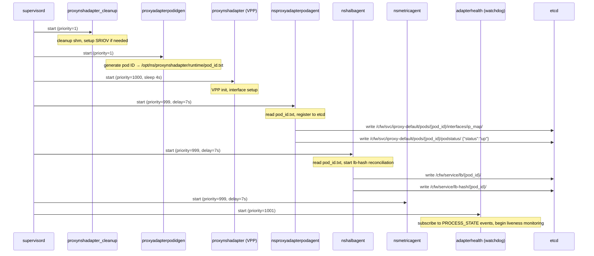
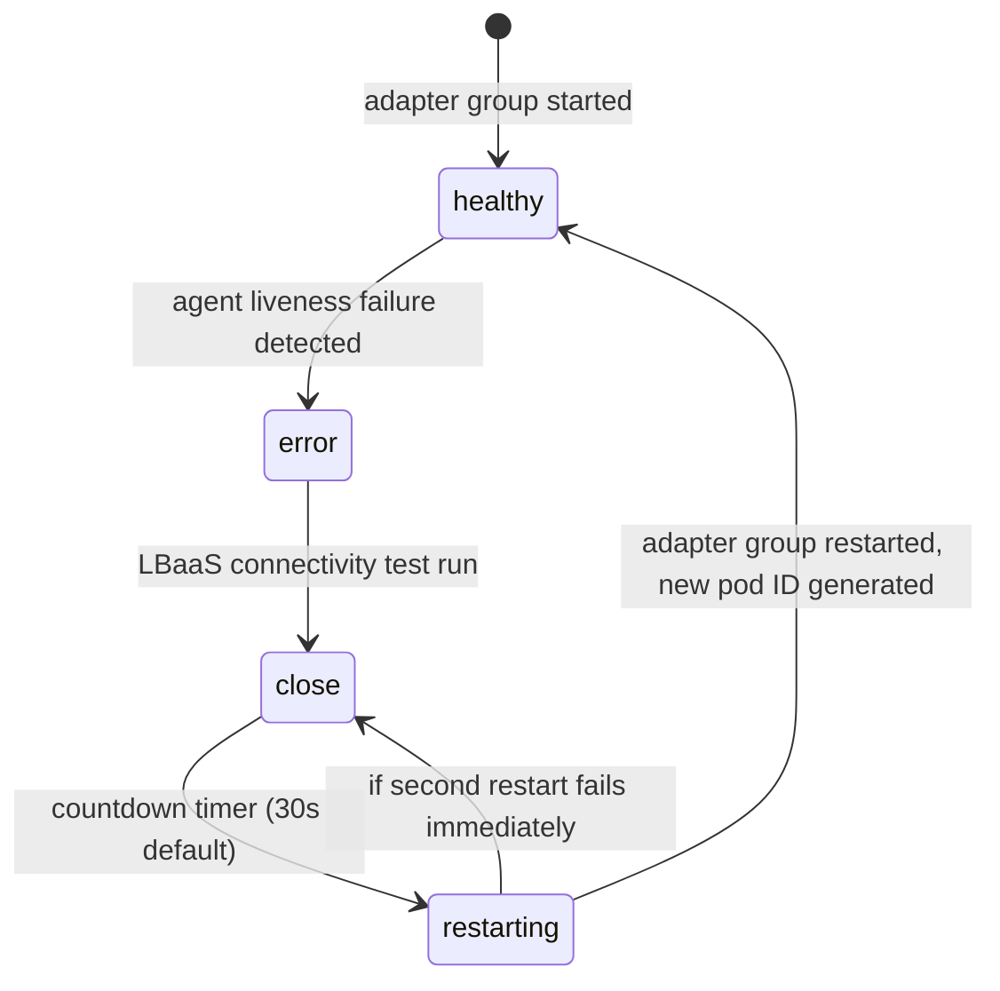

# NSProxy Pod Lifecycle

> **Status:** First version — generated 2026-04-20 from ENG-978048 investigation.
> **Reviewer:** Engineer review required — see appendix for sections needing validation.
> **Update trigger:** After pod lifecycle bugs, CFW version upgrades, or adapter component changes.

---

## 1. Overview

In the Lightning service chain architecture, an **iproxy pod** is a logical identity representing one NSProxy instance running on a dppool node. It is not a Kubernetes pod — it is a named entity registered in etcd that allows the CFW load balancer to route traffic to the NSProxy process on that node.

Key relationships:
- One dppool node runs one NSProxy process (mtnsproxy via supervisord)
- One NSProxy process = one iproxy pod identity
- Pod identity is generated fresh on every adapter group restart
- Pod status ("up"/"down") is maintained in etcd and read by the healthcheck service

Pod ID format:
```
{service_base_name}-default-{hostname}-{timestamp_hex}-{random_6chars}

Examples:
  iproxy-default-dppool3-1-69e02e04-80pu1l   (normal pool)
  iproxydebug-default-dppool3-1-69e02e04-abc  (debug pool)
  iproxystaggered-default-dppool3-1-...        (staggered pool)
```

The `service_base_name` is determined by `NSPROXY_NSH_POOL` in `/etc/environment`:
- `normal` → `iproxy`
- `debug` → `iproxydebug`
- `staggered` → `iproxystaggered`

---

## 2. Pod ID Generation

**Source:** `pkg/proxynshadapter/files/proxynshadapter_id_gen.py`

Pod ID is generated by `proxyadapterpodidgen` — the first process in the adapter group to start (priority=1). It runs once, writes the ID to disk, then sleeps forever (so it stays as a running process in the supervisor group).

```python
# proxynshadapter_id_gen.py:47-61
def gen_random_id():
    timestamp_sec = int(time.time())
    timestamp_hex = hex(timestamp_sec)[2:]          # e.g. "69e02e04"
    random_string = ''.join(random.choices(
        string.ascii_lowercase + string.digits, k=6))  # e.g. "80pu1l"
    return f"{timestamp_hex}-{random_string}"
```

The ID is written to:
```
/opt/ns/proxynshadapter/runtime/pod_id.txt
```

**Critical behavior:** A new pod ID is generated on **every adapter group restart**. The old etcd entries are NOT automatically deleted. This is the root cause of stale entry accumulation when nodes are decommissioned.

---

## 3. Startup Sequence

**Source:** `pkg/proxynshadapter/files/proxynshadapter_supervisor.conf`

Supervisord manages all adapter processes. Priority ordering (lower = starts first):

```
Priority 1    → proxynshadapter_cleanup    (shared memory cleanup, SRIOV setup)
Priority 1    → proxyadapterpodidgen       (generates pod ID, writes to disk)
Priority 998  → nslogexporter             (sleep 2s, then start)
Priority 999  → nsmetricagent             (PROCESS_INIT_DELAY=7s)
Priority 999  → nsproxyadapterdebugagent  (PROCESS_INIT_DELAY=7s)
Priority 999  → nsproxyadapterpodagent    (PROCESS_INIT_DELAY=7s)
Priority 999  → nshalbagent              (PROCESS_INIT_DELAY=7s, HALB_RECONCILE_TIME_PERIOD=20s)
Priority 1000 → proxynshadapter (VPP)    (sleep 4s, then VPP init)
Priority 1001 → adapterhealth (watchdog) (eventlistener, starts last)
```



**Key timing:** `start_process.py` reads the pod ID file with up to 60 retries (1s each) before giving up. This means processes can tolerate `proxyadapterpodidgen` being slightly slow.

---

## 4. etcd Registration

**Source:** Observed from ENG-978048 watchdog logs (`adapter_watchdog_svc_pod_etcd.py`)

### 4.1 etcd Key Schema

| Key Pattern | Written by | Content | Purpose |
|-------------|-----------|---------|---------|
| `/cfw/svc/iproxy-default/pods/{pod_id}/interfaces/ip_map/` | nsproxyadapterpodagent | JSON with svcifinfo (IP, mask, MAC) | Pod network identity |
| `/cfw/svc/iproxy-default/pods/{pod_id}/podstatus/` | nsproxyadapterpodagent | `{"status": "up/down", "time": "..."}` | Pod health status |
| `/cfw/service/lb/{pod_id}/` | nshalbagent | `{"ip": "...", "mac": "...", "svc": "iproxy-default", "time": "..."}` | LB entry for traffic routing |
| `/cfw/service/lb-hash/{pod_id}/` | nshalbagent | hash value | Consistent hash ring entry |

### 4.2 Example etcd Values

```json
// /cfw/svc/iproxy-default/pods/iproxy-default-dppool3-1-69e02e04-80pu1l/interfaces/ip_map/
{
  "ingressifinfo": [],
  "egressifinfo": [],
  "svcifinfo": [{"ipaddr": "10.184.12.93", "ipmask": 25, "iftype": "svc", "macaddr": "52:54:00:4b:a9:3e"}],
  "dpnetifinfo": [],
  "dpsvcifinfo": [],
  "dnsaasifinfo": []
}

// /cfw/svc/iproxy-default/pods/iproxy-default-dppool3-1-69e02e04-80pu1l/podstatus/
{"status": "up", "time": "Wed, 15 Apr 2026 19:41:38 +0000"}

// /cfw/service/lb/iproxy-default-dppool3-1-69e02e04-80pu1l/
{"ip": "10.184.12.93", "mac": "52:54:00:4b:a9:3e", "svc": "iproxy-default", "time": "..."}
```

### 4.3 No TTL / No Auto-expiry

etcd entries have **no TTL**. They persist indefinitely until explicitly deleted. When a node is decommissioned or a pod restarts with a new ID, old entries remain. This is the source of "stale entry" problems.

---

## 5. Healthcheck Flow

**Source:** `proxynshadapter_supervisor.conf` lines 118-141 (nsproxyadapterpodagent config)

The healthcheck service (external to this repo — part of the CFW/Lightning platform) reads pod status from:
```
/cfw/svc/iproxy-default/pods/{pod_id}/podstatus/
```

A pod is marked "down" when:
- Its `podstatus` entry shows `"status": "down"`, OR
- Its etcd entry exists but the node is unreachable (no heartbeat renewal)

`nsproxyadapterpodagent` controls the pod's own status with these parameters:
```
HEALTHCHECK_MAX_FAILURE_COUNT="12"
HEALTHCHECK_PROBE_INTERVAL="5"
```
Meaning: 12 consecutive failures × 5 second interval = **60 seconds** before a pod marks itself "down".

The liveness check mechanism (`liveness_check` script):
```bash
# pkg/proxynshadapter/files/liveness_check
# Returns success iff /tmp/logexporter_alive_log is non-empty (then empties it)
# Exception: always returns success if gdb is running (debug mode)
[[ -f /restartinfo/.restarted_$CONTAINER_NAME ]] || pgrep gdb || \
  { [ -s /tmp/logexporter_alive_log ] && cat /dev/null > /tmp/logexporter_alive_log; }
```

This means **logexporter** is the proxy for liveness — if logexporter stops writing to its alive log, the pod eventually marks itself down.

---

## 6. Liveness Monitoring (Adapter Watchdog)

**Source:** `proxynshadapter_supervisor.conf` lines 168-200 (adapterhealth eventlistener)

The `adapterhealth` process (adapterwatchdog) monitors three agents for liveness:

```
LIVENESS_ENV="debugagent:120:30:2;metricagent:120:30:2;halbagent:120:30:2"
```

Format: `name:initial-delay:timeout:failure-threshold`

| Agent | Initial Delay | Check Interval | Failure Threshold | Restart Trigger |
|-------|-------------|----------------|-------------------|-----------------|
| debugagent | 120s | 30s | 2 consecutive | Yes |
| metricagent | 120s | 30s | 2 consecutive | Yes |
| halbagent | 120s | 30s | 2 consecutive | Yes |

**Watchdog state machine (observed from ENG-978048 logs):**



Key watchdog actions on entering error state (`adapter_watchdog.py:419`):
1. Send `LBaasTestReq` to test etcd + dbgmgr connectivity
2. Send `StopLivenessNotify` to pause liveness checks
3. If LBaaS test passes → proceed to restart
4. Stop adapter group → countdown → restart adapter group

**Important:** The watchdog uses `autorestart=true` (unlike all other adapter processes which use `autorestart=false`). This means the watchdog itself recovers if it crashes, but the adapter group processes do **not** auto-restart — only the watchdog can restart them.

---

## 7. LB Hash Reconciliation (halbagent)

**Source:** `proxynshadapter_supervisor.conf` line 147 (`HALB_RECONCILE_TIME_PERIOD="20"`), ENG-978048 halbagent logs

`nshalbagent` runs a reconciliation loop every **20 seconds** that:
1. Reads LB hash entries from etcd (`/cfw/service/lb-hash/`)
2. Reads VPP's current ARP table (via VPP API/gRPC)
3. Compares them — if they don't match, writes ARP entries to VPP and retries

When hashes don't converge:
```
# Observed in /opt/ns/log/proxynshadapter_halbagent.log every ~20s:
etcd-recon thread:   "LB hashes did not converge. Invoke LB key read."
vpp-connector thread: "Delete arp entries. list: [{'ip': 169.254.11.2, 'mac': ...}]"
```

The `lbhash-updater` thread makes gRPC calls to VPP. If these calls exceed the gRPC deadline (observed: `Deadline Exceeded` after sustained non-convergence), the thread dies, halbagent main thread detects it and exits, and the watchdog restarts the adapter group.

**Known issue (ENG-978048):** The convergence loop has no escape hatch — it retries forever without backoff. In large clusters (~40 pods), sustained non-convergence can eventually exhaust the gRPC deadline. See Section 10.

---

## 8. Interface Setup

**Source:** `pkg/proxynshadapter/files/generate_interface_conf.py`, `proxynshadapter_cleanup.sh`

Interface configuration is determined at startup based on `/etc/environment`:

| Mode | Trigger | Interface | Config written to |
|------|---------|-----------|-------------------|
| TAP (default) | `PROXY_NSH_SVC_INTF=bond0.601` (or similar VLAN) | bond0.NNN | `/data/interface.conf` |
| SR-IOV | `IS_SRIOV_SUPPORTED=true` or `auto` | bond1 VFs | `/data/interface.conf` |

For TAP mode, `generate_interface_conf.py` reads the interface IP/mask/MAC from the kernel (`pyroute2.IPRoute`) and writes `/data/interface.conf`. VPP reads this file during init.

For SR-IOV, `proxynshadapter_cleanup.sh` detects PCI addresses from `/etc/udev/rules.d/` and binds VFs to `vfio-pci` (Intel) or leaves them bound to Mellanox drivers.

**`169.254.11.2` significance:** This is the `adaptereth0` interface IP — a link-local address used for internal pod-to-pod communication in the service chain. It appears in ARP entries that halbagent manages.

---

## 9. Teardown / Cleanup

**Source:** `pkg/proxynshadapter/files/proxynshadapter_cleanup.sh`, `proxynshadapter_supervisor.conf`

On SIGUSR1 (sent by supervisord on stop):
1. `proxynshadapter_cleanup.sh` egress handler fires:
   - Removes `/dev/shm/cfw_logging`
   - Clears logexporter shared memory segments
   - Kills background sleep process
2. VPP process receives stop signal and shuts down

**What is NOT cleaned up on teardown:**
- etcd pod entries (`/cfw/svc/...`, `/cfw/service/lb/...`) — these persist
- The pod ID file at `/opt/ns/proxynshadapter/runtime/pod_id.txt` — overwritten on next start

This means if a node is permanently decommissioned without an explicit etcd cleanup, its entries remain indefinitely.

---

## 10. Known Failure Modes

Derived from ENG-978048 (BCN1, 2026-04-16).

| Failure Mode | Symptom | Root Cause | Affected Component | Resolution |
|-------------|---------|-----------|-------------------|------------|
| Stale etcd entries | Healthcheck reports pods "down"; `show service iproxy pods` shows "down" for non-existent nodes | Node decommissioned without etcd cleanup; no TTL on entries | etcd, healthcheck service | Manual etcd delete of stale keys; or CFW-38.0+ auto-cleanup |
| halbagent gRPC Deadline Exceeded | `lbhash-updater is not alive`; adapter group restart; dppool uptime gap in supervisorctl | LB hashes don't converge → sustained gRPC calls → deadline hit | nshalbagent (`halbagent_lb_watch.py`) | Fix convergence logic or increase gRPC deadline; investigate why hashes don't converge |
| Double restart on recovery | Pod ID changes twice in ~5 seconds after watchdog restart | Second adapter start attempts VPP connection before VPP is ready | adapterwatchdog, proxynshadapter (VPP) | Under investigation |
| pod marked down by logexporter | Pod status "down" despite node being healthy | logexporter stops writing to `/tmp/logexporter_alive_log` | nslogexporter, nsproxyadapterpodagent | Restart logexporter; investigate why it stopped writing |

---

## 11. Sharp Edges

1. **No TTL on etcd entries** — decommissioning a node requires manual etcd cleanup or CFW-38.0+ inframgrlite watcher. Without cleanup, stale entries persist forever and cause false "down" alerts.

2. **New pod ID on every restart** — the old pod ID's etcd entries are orphaned. On large clusters, this accumulates over time.

3. **halbagent reconciliation has no backoff** — the `lbhash-updater` loop retries every 20 seconds indefinitely. On large clusters or during extended non-convergence, this can hit gRPC deadlines.

4. **`169.254.11.2` ARP churn** — halbagent repeatedly deletes and re-adds ARP entries for `169.254.11.2` (adaptereth0) during non-convergence. This is a symptom, not a cause, but useful as a diagnostic signal.

5. **liveness_check is proxied through logexporter** — if logexporter is healthy but NSProxy itself is unhealthy, the liveness check still passes. Liveness does not directly probe NSProxy.

6. **`autorestart=false` for all adapter processes except watchdog** — if any adapter process crashes outside of watchdog supervision (e.g., before watchdog starts), it will not restart automatically.

7. **Pod ID file race** — `start_process.py` polls for the pod ID file with 60 retries × 1s. If `proxyadapterpodidgen` takes longer than 60 seconds (unlikely but possible under load), downstream processes will fail to start.

---

## Quick Reference: Useful Commands

```bash
# Check pod status (from dppool node)
sudo supervisorctl status all

# Check uptime gaps (adapter restart indicator)
# Look for adapter group uptime << adapterhealth uptime

# View pod etcd entries (from kubectl access)
kubectl -n lightning exec -it etcd-client-0 -c etcd -- /bin/sh -c \
  "ETCDCTL_API=3 etcdctl --endpoints=etcd-client:2379 --prefix=True get /cfw/svc/iproxy-default/pods/"

# View LB hash entries
kubectl -n lightning exec -it etcd-client-0 -c etcd -- /bin/sh -c \
  "ETCDCTL_API=3 etcdctl --endpoints=etcd-client:2379 --prefix=True get /cfw/service/lb-hash/"

# Delete stale pod entry (replace with actual pod ID)
kubectl -n lightning exec -it etcd-client-0 -c etcd -- /bin/sh -c \
  "ETCDCTL_API=3 etcdctl --endpoints=etcd-client:2379 del /cfw/svc/iproxy-default/pods/iproxy-default-dppool22-2-69e00920-zkrcb4 --prefix"

# Check watchdog logs for restart reason
sudo grep "restart\|ERROR\|liveness" /opt/ns/log/proxynshadapter_watchdog.log | tail -50

# Check halbagent convergence
sudo grep "did not converge\|lbhash\|Deadline" /opt/ns/log/proxynshadapter_halbagent.log | tail -50

# Check current pod ID
cat /opt/ns/proxynshadapter/runtime/pod_id.txt

# Check cluster membership (from local machine)
tsh ls --cluster <cluster-name> | grep dppool
```

---

## Appendix: How This Document Was Generated and How to Update It

### Generation Plan (executed 2026-04-20)

This document was generated from the ENG-978048 investigation using the following sources, in order:

| Source | Location | What was extracted |
|--------|----------|-------------------|
| Supervisor config | `pkg/proxynshadapter/files/proxynshadapter_supervisor.conf` | Process startup order, priorities, liveness config |
| Pod ID generator | `pkg/proxynshadapter/files/proxynshadapter_id_gen.py` | ID format, generation logic |
| Process starter | `pkg/proxynshadapter/files/start_process.py` | env setup, pod ID propagation, retry logic |
| Utility functions | `pkg/proxynshadapter/files/proxynshadapter_utils.py` | Service base name, VPP version detection |
| Interface config | `pkg/proxynshadapter/files/generate_interface_conf.py` | TAP vs SR-IOV, interface.conf generation |
| Cleanup script | `pkg/proxynshadapter/files/proxynshadapter_cleanup.sh` | Teardown sequence, SRIOV cleanup |
| Post-install script | `pkg/proxynshadapter/DEBIAN/postinst` | Install-time setup |
| Liveness check | `pkg/proxynshadapter/files/liveness_check` | How liveness is determined |
| ENG-978048 logs | Live dppool3-1.bcn1 investigation | etcd key schema, failure mode observations, watchdog state machine |

**Sources NOT available during generation** (these sections are based on log observations only):
- `nshalbagent` source (`halbagent_app.py`, `halbagent_lb_watch.py`) — in a separate Python repo
- `adapterwatchdog` source (`adapter_watchdog.py`, `adapter_watchdog_state.py`) — in a separate Python repo
- `nsproxyadapterpodagent` source — in a separate Python repo

### Sections Requiring Engineer Review

- [ ] **Section 4 (etcd schema)** — key paths inferred from log observations; verify against live cluster or podagent source
- [ ] **Section 5 (healthcheck flow)** — healthcheck service behavior inferred; verify with CFW/Lightning team
- [ ] **Section 7 (LB hash reconciliation)** — based on log observations only; verify against `halbagent_lb_watch.py` source
- [ ] **Section 8 (interface setup)** — `169.254.11.2` significance needs confirmation from CFW team
- [ ] **Section 10 (failure modes)** — double restart root cause under investigation

### How to Update This Document

**When to update:**
- After a pod lifecycle bug fix that reveals new behavior
- After a CFW version upgrade that changes adapter behavior
- After confirming/correcting any section marked for review above

**How to update:**
1. Switch to Opus (`/model claude-opus-4-5`)
2. Provide the new findings or bug ticket
3. Ask Claude to update specific sections with citations
4. Engineer reviews the diff before committing
5. Update the "Status" line at the top with new date and changes

**Model guidance:**
- Use **Opus** to generate or substantially revise sections (heavy synthesis required)
- Use **Sonnet** for minor corrections, adding commands, or updating failure mode tables
