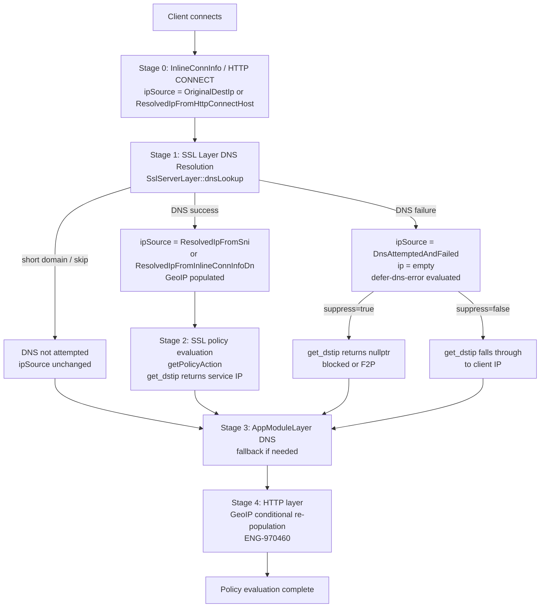
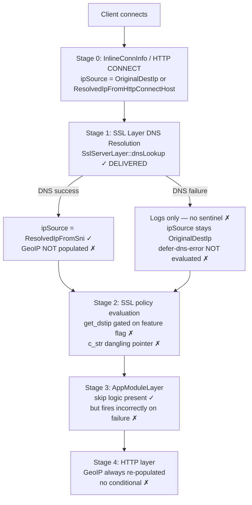
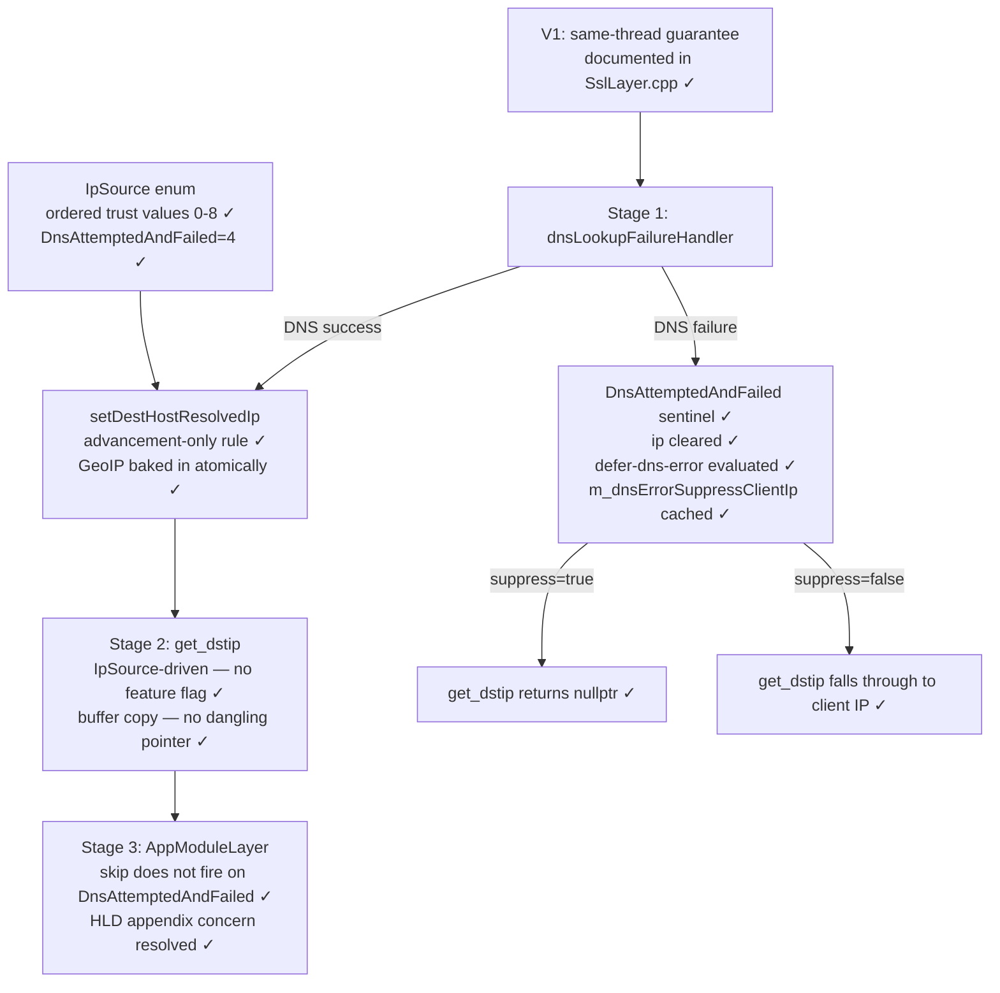
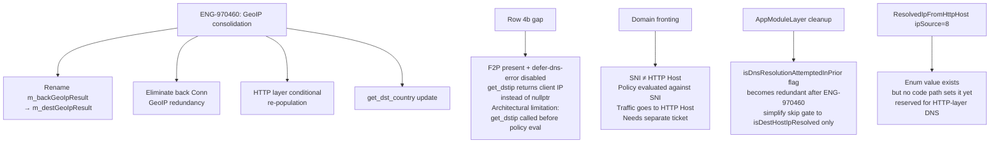

# ENG-710107: Destination Addressing — Design Context

**Jira:** ENG-710107
**Date:** 2026-04-28
**Author:** Amitayu Das
**Status:** Agreed
**Related specs:**
- `2026-04-27-eng-710107-dest-addressing-impl.md` — forward-looking implementation guide
- `2026-04-14-nplan6618-architectural-decisions.md` — architectural decision record
- `2026-04-09-pr14246-geip-on-svc-resolved-dest-addr-design.md` — superseded PR #14246 design

---

## Problem Statement

PR #14206 (merged 2026-04-27) introduced DNS resolution at the SSL layer before
`getPolicyAction()`, but left seven gaps that together made the feature unreliable in
production: `get_dstip()` could not distinguish "DNS never ran" from "DNS failed" (making
the `defer-dns-error = allow` path silently broken), returned a dangling `c_str()` pointer,
was gated on a per-connection flag rather than session state, and never evaluated
`defer-dns-error` at the SSL layer. GeoIP was not populated at DNS resolution time, leaving
geo-based DnD policy conditions blind during SSL-layer evaluation. The `IpSource` enum had
no trust ordering, allowing a lower-trust source to silently overwrite a higher-trust
resolution. A unit test asserted `SSL_connect` success while its comment said "expected to
fail", masking a real verification gap.

---

## Execution Stages Affected

```
Stage 0 — InlineConnInfo / HTTP CONNECT parsing
  File: libs/netlayer/src/InlineConnectionInfo.cpp:857
        libs/netlayer/src/AppModuleLayer.cpp (HTTP CONNECT path)
  What it does today: Populates m_destHost with domain/IP and source from wire data.
                      Sets ipSource = OriginalDestIp, source = OriginalDestDomain.
                      HTTP CONNECT resolves domain → sets ResolvedIpFromHttpConnectHost.
  What this feature changes: Nothing at this stage.
  ipSource written: OriginalDestIp (transparent) / ResolvedIpFromHttpConnectHost (explicit)

Stage 1 — SSL layer DNS resolution
  File: libs/netlayer/src/SslServerLayer.cpp:preprocessForPolicyLookup()
        libs/netlayer/src/SslServerLayer.cpp:dnsLookup()
        libs/netlayer/src/SslServerLayer.cpp:dnsLookupSuccessHandler()
        libs/netlayer/src/SslServerLayer.cpp:dnsLookupFailureHandler()
  What it does today: DNS resolves domain from SNI or InlineConnInfo. On success, calls
                      setDestHostResolvedIp() with ResolvedIpFromSni or
                      ResolvedIpFromInlineConnInfoDn. On failure, logs only.
  What this feature changes:
    - dnsLookupFailureHandler() now sets DnsAttemptedAndFailed sentinel and evaluates
      defer-dns-error (global + tenant), caching result as m_dnsErrorSuppressClientIp.
    - dnsLookupSuccessHandler() unchanged; setDestHostResolvedIp() now atomically
      populates GeoIP and enforces advancement-only rule.
  ipSource written: ResolvedIpFromSni | ResolvedIpFromInlineConnInfoDn | DnsAttemptedAndFailed

Stage 2 — SSL policy evaluation
  File: libs/netlayer/src/SslServerLayer.cpp:getPolicyAction()
  What it does today: Reads m_destHost.value and getSslSniSource() for policy lookup.
                      get_dstip() is called indirectly via bypass policy args.
  What this feature changes: get_dstip() now driven purely by IpSource — no feature flag.
  ipSource read: all values

Stage 3 — AppModuleLayer DNS skip
  File: libs/netlayer/src/AppModuleLayer.cpp:dnsLookup()
  What it does today: Skips Stage 3 DNS when ALL THREE conditions hold:
                        isDnsResolutionAttemptedInPrior() == true
                        AND domain matches netSessDestHost.value
                        AND isDestHostIpResolved() == true
                      Falls through to DNS otherwise.
  What this feature changes: When SSL-layer DNS fails, ipSource is now
                             DnsAttemptedAndFailed. isDestHostIpResolved() returns
                             false for this value, so the three-part skip condition
                             does not fire — Stage 3 runs as expected.
                             This resolves the concern raised in the NPLAN-6618 HLD
                             appendix ("Implication for isDnsResolutionAttemptedInPrior()
                             Skip Logic") that the skip would fire on failure and prevent
                             defer-dns-error from being evaluated. With the sentinel, the
                             skip correctly does not fire on failure. defer-dns-error is
                             now evaluated at Stage 1 failure time (not as a Stage 3
                             workaround) and the result is cached in m_dnsErrorSuppressClientIp.
  ipSource read: ResolvedIpFrom* (for isDestHostIpResolved() skip decision)

Stage 4 — HTTP layer GeoIP (ENG-970460, not yet implemented)
  File: libs/http/src/HttpRequestEngine.cpp:populateBackDetailsInNetSession()
  What it does today: Always calls populateBackGeoInfo() after HTTP-layer DNS.
  What this feature changes: Nothing yet. ENG-970460 will add a conditional — skip if
                             destGeoIpResult already populated from a DNS-resolved IP.
  ipSource read: (future) OriginalDestIp check to decide whether to re-populate
```

---

## Proxy Mode Applicability

```
                          Stage 0        Stage 1          Stage 2        Stage 3
Transparent proxy:          ✓              ✓                ✓              ✓
  (InlineConnInfo IP)     untrusted     service DNS      reads S1       may retry DNS
Explicit proxy (CONNECT):   ✓              ✓                ✓              ✓
  (CONNECT host domain)   trusted*      service DNS      reads S1       skipped if S0 resolved

* CONNECT host resolved at S0; S1 DNS may run again for SNI if different from CONNECT host.
```

**Transparent proxy end-to-end:**
Client sends InlineConnInfo with raw dest IP. Stage 0 sets `OriginalDestIp`. Stage 1 DNS
resolves SNI or InlineConnInfo domain → `ResolvedIpFromSni` / `ResolvedIpFromInlineConnInfoDn`.
On failure: `DnsAttemptedAndFailed` set; `m_dnsErrorSuppressClientIp` evaluated. Stage 2
`get_dstip()` returns service IP (success), nullptr (suppress), or client IP (allow).

**Explicit proxy end-to-end:**
Client sends HTTP CONNECT with domain. Stage 0 resolves → `ResolvedIpFromHttpConnectHost`.
Stage 1 may run again for SNI; advancement-only rule prevents overwriting Stage 0 result
with a lower-trust value. Stage 2 reads Stage 0 or Stage 1 result. Stage 3 skips DNS because
`isDestHostIpResolved()` is true.

---

## Design Contracts

1. After DNS failure at SSL layer, `m_destHost.ipSource == IpSource::DnsAttemptedAndFailed`
   and `m_destHost.ip` is empty.
2. `setDestHostResolvedIp()` with a lower-or-equal `ipSource` than the current value is a
   no-op — the existing (higher-trust) value is preserved.
3. Every successful call to `setDestHostResolvedIp()` with a non-empty IP triggers
   `populateBackGeoInfo()` atomically.
4. `get_dstip()` never reads `isSslLayerDnsResolutionEnabled()` — it is driven solely
   by `IpSource`.
5. When `ipSource == DnsAttemptedAndFailed` and `isDnsErrorSuppressClientIp()` is false,
   `get_dstip()` falls through to return the client IP from InlineConnInfo.
6. When `ipSource == DnsAttemptedAndFailed` and `isDnsErrorSuppressClientIp()` is true,
   `get_dstip()` returns nullptr.
7. The `m_dnsErrorSuppressClientIp` flag is evaluated once at DNS-failure time by
   `dnsLookupFailureHandler()` against both global and per-tenant `defer-dns-error` config.
   It is not re-evaluated at `get_dstip()` time.
8. In `handleNoSniScenario()`, the `source` argument to every `setSslSni()` call correctly
   identifies the origin of the value being stored. Verified by audit — all branches correct.
9. `SslLayerDnsResolutionFailure` test assertion is consistent with its comment: `SSL_connect`
   returns 1 (success); DNS failure is detected at AppModule layer, not during TLS handshake.

---

## State / Data Model Changes

```
Field: DnsAttemptedAndFailed
Type: ns::host::IpSource enum value (= 4)
Location: libs/netsvc/NsHost.hpp
Lifecycle: set at Stage 1 (dnsLookupFailureHandler), read at Stage 2 (get_dstip)
Invariant: When this value is set, m_destHost.ip is always empty.

Field: m_dnsErrorSuppressClientIp
Type: bool (default false)
Location: NetSession — libs/netsvc/NetSession.hpp
Lifecycle: set at Stage 1 (dnsLookupFailureHandler), read at Stage 2 (get_dstip)
Invariant: Only meaningful when ipSource == DnsAttemptedAndFailed. Reflects the
           two-level defer-dns-error gate (global && tenant) evaluated at failure time.
           Not re-evaluated after being set.

Enum: IpSource (modified)
Type: enum class IpSource : unsigned int
Location: libs/netsvc/NsHost.hpp
Change: Explicit integer values assigned (0–8) encoding trust order.
        Advancement-only rule in setDestHostResolvedIp() enforces monotonic progression.
        DnsAttemptedAndFailed = 4 inserted between raw-IP sources (1–3) and DNS-resolved
        sources (5–8).
```

---

## Failure Modes and Fallback Policy

```
Failure: DNS lookup returns NS_TASK_ERR (async) or NS_NBERR (sync)
Sentinel set: ipSource = DnsAttemptedAndFailed, ip = ""
Config: defer-dns-error (global flag AND per-tenant flag both must be true)
  = both enabled  → m_dnsErrorSuppressClientIp = true
                    get_dstip() returns nullptr
                    No F2P: connection blocked at policy engine
                    F2P present: chain proxy handles it (nullptr is safe — F2P is domain-based)
  = either disabled → m_dnsErrorSuppressClientIp = false
                      get_dstip() falls through to client-provided IP from InlineConnInfo
                      Connection allowed with client IP (transparent proxy only —
                      explicit proxy has CONNECT-resolved IP at Stage 0, so this path
                      is only reached in transparent proxy with no prior resolution)

Known gap in failure handling (row 4b of behaviour matrix):
  When F2P policy is present AND defer-dns-error is disabled, the ADR specifies that
  get_dstip() should return nullptr regardless — nullptr is safe because F2P routing
  is domain/user-based and the chain proxy performs its own DNS resolution.
  Current implementation: m_dnsErrorSuppressClientIp = false → get_dstip() returns
  client IP. The F2P flow still succeeds (domain-based match), but the untrusted
  client IP enters IP-based policy condition evaluation rather than being suppressed.
  Full row 4b compliance requires get_dstip() to check for F2P policy presence and
  return nullptr independently of defer-dns-error. See Known Gaps and Deferred Work,
  gap 5 for the architectural reason this is not implemented here.

Failure: setDestHostResolvedIp() called with lower-trust ipSource
Result: no-op — existing value preserved (advancement-only rule)
No config: always silent no-op; no fallback needed

Failure: populateBackGeoInfo() (ns_geoip_get_loc) returns NS_RESULT_ERR
Result: m_backGeoIpResult remains null; get_dst_country() falls through to live lookup
        (existing behaviour preserved); IP-based policy still correct
```

---

## Known Gaps and Deferred Work

1. **ENG-970460 — GeoIP consolidation (partially delivered; remainder outstanding):**
   - Rename `m_backGeoIpResult` → `m_destGeoIpResult`, `populateBackGeoInfo()` →
     `populateDestGeoInfo()`, `getBackGeoIpResult()` → `getDestGeoIpResult()`.
   - Eliminate back Conn GeoIP redundancy: remove seeding in `setupBackendInfo()` and
     `copyGeoIpResultToLocal()` rescue on teardown.
   - Conditional re-population at HTTP layer: skip `populateDestGeoInfo()` if
     `ipSource >= ResolvedIpFromInlineConnInfoDn` (already DNS-resolved).
   - Update `get_dst_country()` to check session field first, skip live lookup if valid.
   - **Note:** Early GeoIP population from SSL layer is delivered by this PR via
     `populateBackGeoInfo()` inside `setDestHostResolvedIp()`. The four items above
     remain outstanding in ENG-970460.

2. **Domain fronting (Point 9, NPLAN-6618 ADR):**
   When SNI ≠ HTTP Host header, the HTTP Host resolution (ipSource = 8) silently advances
   past the SNI resolution (ipSource = 7) via the advancement-only rule. The policy engine
   evaluated the SNI domain; the actual traffic goes to the HTTP Host domain. This is a
   security control gap. Correct handling requires re-evaluating policy against the HTTP
   Host domain on mismatch detection in
   `HttpRequestEngine::updateNetSessionDestHost()`. Requires a separate ticket.

3. **`ResolvedIpFromHttpHost` (ipSource = 8) not yet produced:**
   The enum value exists and is ordered correctly but no code path currently sets it.
   It is reserved for the HTTP-layer DNS resolution path once ENG-970460 completes.

4. **AppModuleLayer DNS skip gate:**
   Currently gated on `isDnsResolutionAttemptedInPrior()` + domain match +
   `isDestHostIpResolved()`. After ENG-970460, the gate should be simplified to
   `isDestHostIpResolved()` alone — the `isDnsResolutionAttemptedInPrior()` flag becomes
   redundant once IpSource fully encodes the state.

5. **Row 4b — F2P present + defer-dns-error disabled (architectural limitation):**
   When F2P policy is present and DNS failed but defer-dns-error is disabled,
   `get_dstip()` currently returns the client IP instead of nullptr. The ADR specifies
   nullptr is correct here because F2P routing is domain/user-based — the client IP
   should be suppressed from IP-based policy evaluation regardless of defer-dns-error
   config.
   The reason this is not implemented: `get_dstip()` is called as an *input* to
   `lookupPolicyAction()` — it executes before policy is evaluated and therefore
   cannot observe whether an F2P rule matches. Checking for F2P policy presence
   inside `get_dstip()` would invert the dependency between the two functions, which
   is architecturally incorrect. Full row 4b compliance would require either moving
   the F2P check to a post-policy stage or introducing a session flag set by a prior
   F2P policy evaluation on a previous request. Neither is in scope for this PR.
   The impact is limited: the F2P flow itself succeeds (domain/user-based match),
   but IP-based policy conditions evaluate against an untrusted client IP rather than
   seeing no IP.

---

## Implementation Breakdown

```
PR #14206 (merged 2026-04-27, commit 8d5d362579):
  Delivered: Contracts 1 (partial — no sentinel), 4 (partial — still flag-gated),
             5 (partial — c_str() dangling), DNS resolution machinery end-to-end.
  Left open: Contracts 1 (sentinel), 2, 3, 4 (flag retirement), 5 (dangling ptr),
             6, 7, 8, 9 (audit), 10 (test assertion).

ENG-710107 / feature/eng-710107-dest-addressing (this branch):
  Delivered: All 10 contracts.
  Also delivers: Early SSL-layer GeoIP population (ENG-970460) via
                 `populateBackGeoInfo()` inside `setDestHostResolvedIp()`.

ENG-970460 (future):
  Will deliver: GeoIP field rename, back Conn redundancy elimination, HTTP-layer
               conditional re-population, get_dst_country() update.
```

---

## Diagrams

### Diagram 1 — Full NPLAN-6618 vision (what the EPIC set out to do)



---

### Diagram 2 — What PR #14206 delivered (foundational work)



---

### Diagram 3 — What this PR adds (ENG-710107)



---

### Diagram 4 — What remains outstanding


