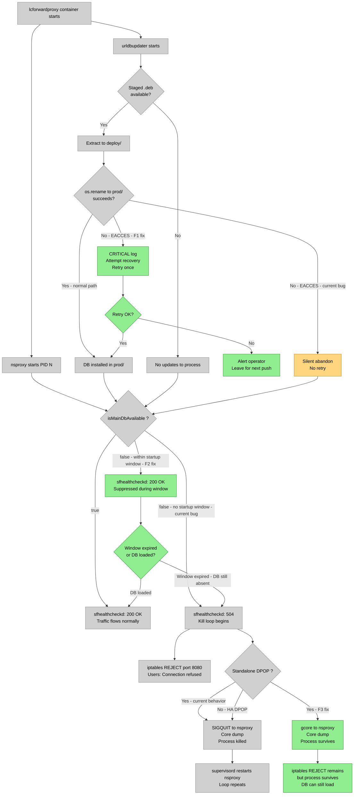

# DPOP Healthcheck Kill Loop on NSIQ URL DB Absence: RCA and Hotfix Design

**Jira:** ENG-984299
**Date:** 2026-05-13
**Author:** Amitayu Das
**Status:** Draft

---

## 1. Problem Statement

After upgrading a DPOP appliance to APL R135, the `lcforwardproxy` container enters a
kill loop driven by `sfhealthcheckd`: nsproxy returns HTTP 504 on every health check,
`sfhealthcheckd` inserts an iptables REJECT rule on port 8080 and sends SIGQUIT to
nsproxy, supervisord restarts nsproxy, and the cycle repeats. Users see "Connection
refused by proxy server." The kill loop begins within 80 seconds of container start and
continues until external intervention or until the NSIQ URL DB becomes available by
other means. The root cause is a filesystem permission error in `urldbupdater` that
prevents the NSIQ URL DB from being installed into `prod/` on first startup after the
upgrade — combined with a health-check gate introduced in R133 that makes nsproxy fail
health checks whenever the DB is enabled but not yet loaded.

---

## 2. Execution Stages Affected

### Stage 1 — Container startup and urldbupdater

```
File: (Python) opt/ns/bin/urldbupdater / NSIQUrlDbUpdater class
What it does today:
  - On startup, checks for a staged .deb in nsiq-urldb/staged/
  - Extracts the .deb to a deploy/ directory
  - Calls os.rename(deploy/nsiq-urldb-<ver>, prod/nsiq-urldb-<ver>)
What this hotfix changes:
  - F1: On os.rename raising EACCES (errno 13), log CRITICAL, attempt directory
    correction, retry once. If still failing, leave staged package for next cloud push.
```

Evidence: urldbupdater-nsiq-urldb.log (Artifactory tar-636):
```
15:21:57  ERROR  NSIQUrlDbUpdater: Error: unable to move from deploy-dir
          to dest-dir: /opt/ns/url_categ/nsiq-urldb/prod/nsiq-urldb-20260504.001549
          due to exception: [Errno 13] Permission denied
```

### Stage 2 — nsproxy health check gate (isHealthCheckSuccess)

```
File: libs/http/src/AppModuleHttpProxy.cpp — AppModuleHttpProxy::isHealthCheckSuccess()
Introduced by: commit d3a7929e81 (PR #12676, ENG-639110) — present in R133+
What it does today:
  if (NsiqUrlDbLookup::instance().isNsiqUrlDbEnable() &&
      !NsiqUrlDbLookup::instance().isMainDbAvailable()) {
      return false;  // → nsproxy replies HTTP 504 to sfhealthcheckd
  }
What this hotfix changes:
  - F2: Suppress this gate during a startup window (e.g., 5 minutes from first process
    start). Only return false if the DB was previously available and has since
    disappeared — not on a fresh startup where it has not yet loaded.
```

**Gate design note:** The gate intent is correct — if nsiq-urldb is enabled and absent,
traffic is silently miscategorized. The gate must not be removed. The fault is that it
fires on first-ever startup before urldbupdater has had any opportunity to run (a race
condition). The ENG-639110 revert-and-re-land history (PR #12326 → #12398 → #12676)
suggests this gate has already caused at least one prior regression. Owner for F2: proxy
team (they introduced the gate and are best positioned to add the startup-window guard).

Evidence: git history — not in R132; first shipped R133 (commit d3a7929e81 after
revert-and-re-land cycle via PR #12326 → #12398 → #12676).

### Stage 3 — sfhealthcheckd kill decision

```
File: (Python) opt/ns/bin/sfhealthcheckd.py
What it does today:
  - 60-second startup grace window; allows traffic
  - Sends HTTP GET to nsproxy health-check listener on port 7998
  - On non-200 response: inserts iptables REJECT on port 8080, sends SIGQUIT to nsproxy
  - "Invalid http status='504'" — logged when request completed and nsproxy returned 504
    (distinct from "Connect Timeout"/"Connect Error" which indicate port unreachable)
What F3 would change:
  - On standalone DPOP: replace SIGQUIT with gcore (non-fatal core dump), do not kill.
```

Evidence: sfhealthcheckd.log (tar-636):
```
2026-05-07 15:21:42  INFO  Healthcheck STARTED, assume healthy status and allow traffic.
2026-05-07 15:21:42  INFO  Wait for 60 seconds before performing healthcheck
2026-05-07 15:22:42  INFO  Performing Healthcheck
2026-05-07 15:23:02  WARNING  Healthcheck FAILED. Reason='Invalid http status=504'.
2026-05-07 15:23:02  INFO  Adding local TCP rule
2026-05-07 15:23:02  INFO  Creating core dump of process='nsproxy' pid='83'
```

---

## 3. Proxy Mode Applicability

This issue is specific to **appliance / DPOP forward proxy deployment**. It does not
affect cloud-hosted NSProxy pods (which use a different healthcheck architecture:
`healthchecksvc` → etcd → NSHGW — documented in `nsproxy-pod-lifecycle.md`).

```
                                 Stage 1      Stage 2      Stage 3
                                 (urldbupdater) (HC gate)  (sfhealthcheckd)
DPOP standalone forward proxy:      ✓            ✓            ✓
DPOP HA forward proxy:              ✓            ✓            ✓ (kill less harmful)
Cloud NSProxy pod:                  ✗            ✗            ✗
```

Note: The kill-loop is more severe on standalone DPOP (no HA peer to absorb traffic)
than on HA (traffic can failover). F3 (gcore instead of SIGQUIT) is most valuable on
standalone, but the root fix (F1 + F2) makes F3 less critical.

---

## 4. Kill-Loop Cascade (Full Sequence)

The following sequence was reconstructed from tar-636 and tar-637 logs (May 7 occurrence;
April 14 occurrence followed the same pattern):

```
lcforwardproxy container restart
         │
  ┌──────┴──────────────────┐
  │                         │
nsproxy starts          urldbupdater starts
(PID 83)                (PID 86)
  │                         │
  ▼                         ▼
NSIQ URL DB files        Staged .deb ready —
ABSENT from prod/        os.rename to prod/ fails:
[N2]                     [Errno 13] Permission denied [N3]
  │                         │
  │           DB never installed
  │
sfhealthcheckd: 60 s grace window [N5]
  │
  ▼  (60 s later)
GET http://localhost:7998/  ──►  nsproxy: isMainDbAvailable()==false
                                       → HTTP 504 [N5, N8]
  │
  ├─────────────────────────────────────────────────┐
  ▼                                                 ▼
iptables REJECT on port 8080              SIGQUIT → core dump + kill [N6]
← users: "Connection refused" [N6]                 │
                                          supervisord restarts nsproxy
                                          urldbupdater: "No updates" [N4]
                                                       │
                                               (LOOP ──────────────┘)
```

Self-resolution path: if the cloud pushes a new DB package before the next cycle AND the
permission error is resolved by other means, urldbupdater can succeed and nsproxy becomes
healthy. This explains the April 14 self-resolution after ~2 hours (grace from cloud push
timing + possible UID correction by appliance housekeeping).

---

## 5. Root Cause: Why prod/ Has Wrong Ownership

The `prod/` directory was created during a previous container run under a different UID —
a common outcome after an appliance OS-layer upgrade that changes container user mapping.
The container's `urldbupdater` process cannot `os.rename` into a directory owned by a
different UID. This DPOP ran on a different server from the three that upgraded without
issue (confirmed May 23); the other servers had a clean install history.

---

## 6. What Is NOT the Root Cause

| Symptom | Why Not Root Cause |
|---------|-------------------|
| `role_id`/`secret_id` empty (Vault CRITICAL) | DPOP intentionally has empty vault credentials. Non-fatal. Confirmed by Nauman May 8. |
| Checksum mismatch for `nsbinary.cfg` | `nsbinary.cfg` is a symlink modified on startup. Benign. Confirmed by Nauman May 6. |
| KMIP errors | Expected on appliance deployment. Confirmed by Datta May 8. |
| eth1 interface instability in syslog | Downstream effect of container restarts triggered by sfhealthcheckd, not the primary cause. |
| eth1 IP address not brought UP (Vijay's May 7 comment) | Downstream of container crash loop, not upstream. Nauman confirmed container and ports are up. |

---

## 7. Design Contracts

The following must hold for the hotfix to be complete and correct:

1. **F1 contract:** When `urldbupdater`'s `NSIQUrlDbUpdater` receives `[Errno 13]` from
   `os.rename`, it must log at CRITICAL severity and attempt recovery before abandoning
   the install. A second abandonment without retry is acceptable; silent abandonment is
   not.

2. **F1 contract:** The recovery attempt must not rely on running as root inside the
   container. If the container user lacks write permission to `prod/`, the fix must
   either: (a) create a fresh `prod/` directory with correct ownership via `os.makedirs`,
   or (b) report the failure via an appliance alert/metric so operators are notified.

3. **F1 contract:** After recovery, `urldbupdater` must retry the `os.rename` in the
   same startup run. If the retry fails, it must leave a next-run flag so the next
   cloud-pushed package triggers a fresh attempt (rather than "No updates to process").

4. **F2 contract:** `isHealthCheckSuccess()` must not return `false` due to
   `isMainDbAvailable()==false` during the first N minutes after nsproxy process start,
   where N is configurable and defaults to 5.

5. **F2 contract:** The startup-window suppression applies only to the first startup after
   a fresh DB absence. If the DB was previously loaded and subsequently became
   unavailable (e.g., DB corruption mid-run), the gate must fire normally.

6. **F2 contract:** The startup-window implementation must be thread-safe given nsproxy's
   concurrent request processing.

7. **F3 contract (standalone hardening, not required for hotfix):** On standalone DPOP,
   `sfhealthcheckd` must use `gcore` (non-fatal) to collect core dumps instead of
   SIGQUIT. The iptables REJECT rule may still be inserted; only the process kill is
   suppressed.

8. **Backport contract:** Fixes F1 and F2 must be verifiable on a test appliance
   before the R135 hotfix build is cut. Verification evidence must be attached to
   this ticket.

---

## 8. State / Data Model Changes

### F2 — Startup window flag in nsproxy

```
Field: (TBD — e.g., m_startupWindowExpiry or m_dbFirstSeenHealthy)
Type: std::chrono::steady_clock::time_point or atomic bool
Location: AppModuleHttpProxy (libs/http/src/AppModuleHttpProxy.cpp)
Lifecycle: Set at nsproxy startup (process init); read at each isHealthCheckSuccess() call
Invariant: Once the DB is observed as available (isMainDbAvailable()==true), the startup
           window flag is permanently cleared so the gate fires normally from that point.
```

---

## 9. Failure Modes and Fallback Policy

| Failure | Stage | Current behavior | Required behavior (post-hotfix) |
|---------|-------|-----------------|----------------------------------|
| `prod/` owned by wrong UID | urldbupdater (Stage 1) | Silent EACCES abandonment; no retry | CRITICAL log; recovery attempt; retry; alert if retry fails |
| DB absent on fresh startup | isHealthCheckSuccess (Stage 2) | Immediate HTTP 504 → kill loop | Suppress gate for startup window; return 200 until window expires or DB loads |
| DB absent mid-run (post-load) | isHealthCheckSuccess (Stage 2) | HTTP 504 (correct behavior) | Unchanged — gate fires normally |
| nsproxy killed by SIGQUIT on standalone | sfhealthcheckd (Stage 3) | Traffic blocked + process killed | F3: gcore instead of SIGQUIT (no traffic change, process survives) |

---

## 10. Known Gaps and Deferred Work

1. **VPE fix (F4) status unknown.** Jean Cheng (VPE) stated on 2026-05-12 that VPE has
   already addressed this issue and added metrics/log visibility. Ticket number not yet
   confirmed. If VPE's fix covers R135 and addresses both F1 and F2, this hotfix effort
   may be superseded. **Action: ping Jean Cheng for ticket number before starting
   implementation.**

2. **sfhealthcheckd standalone detection (F3)** deferred — not required for the R135
   hotfix. Should be filed as a follow-on improvement ticket.

3. **Metrics/log visibility** for the kill-loop (VPE planned, per Jean Cheng) — deferred
   to the VPE ticket. The `#vpe-nsproxy-warning` channel alerting is part of that work.

4. **Core dump analysis from tar-637 is a blocker for finalizing the fix scope.**
   The current analysis assumes nsproxy dies solely from SIGQUIT issued by
   sfhealthcheckd. The core dump must be analyzed to confirm this. If the core dump
   shows an independent nsproxy crash (e.g., null dereference when the DB is absent),
   then:
   - There is a third failure path not covered by F1 or F2.
   - F3 (gcore instead of SIGQUIT) would be insufficient — nsproxy would crash on its
     own regardless.
   - Fix scope expands to include a nsproxy crash fix.
   **The fix must not be committed until the core dump is analyzed.** Specifically: if
   the backtrace shows a signal other than SIGQUIT (e.g., SIGSEGV, SIGABRT), F1+F2
   alone will not prevent the crash.

5. **Workaround requires root access** (customer has not authorized). Documented for
   completeness:
   ```bash
   docker exec lcforwardproxy ls -la /opt/ns/url_categ/nsiq-urldb/prod/
   docker exec -u root lcforwardproxy chown -R <container-user>:<container-group> \
     /opt/ns/url_categ/nsiq-urldb/prod/
   docker restart lcforwardproxy
   ```
   This is not a path the customer will take; the hotfix must not depend on it.

---

## 11. Implementation Breakdown

| PR | Contracts | Component | Branch base |
|----|-----------|-----------|-------------|
| PR A — F1 (urldbupdater EACCES recovery) | Contracts 1, 2, 3 | Python / urldbupdater | Release135 |
| PR B — F2 (HC gate startup window) | Contracts 4, 5, 6 | C++ / AppModuleHttpProxy.cpp | Release135 |
| PR C (optional) — F3 (gcore on standalone) | Contract 7 | Python / sfhealthcheckd.py | Release135 or develop |

If VPE's F4 ticket is confirmed to cover R135, PRs A and B may be replaced by a
backport of F4. Update this spec with the VPE ticket number when confirmed.

---

## 12. Evidence References

| Tag | Source | Description |
|-----|--------|-------------|
| N1 | nsforwardproxy.log (tar-636, tar-637) | nsproxy PID sequence: 83→483→84→534 |
| N2 | nsforwardproxy.log (tar-636, tar-637) | NSIQ URL DB absent at startup — `can not open nsiq-urldb dir file` |
| N3 | urldbupdater-nsiq-urldb.log (tar-636) | `[Errno 13] Permission denied` on `os.rename` to `prod/` |
| N4 | urldbupdater-nsiq-urldb.log (tar-636) | "No updates to process" on subsequent restart — staged package already consumed |
| N5 | sfhealthcheckd.log (tar-636) | 60 s grace window; GET to port 7998; HTTP 504 received |
| N6 | sfhealthcheckd.log (tar-636) | iptables REJECT on port 8080; SIGQUIT to nsproxy; core dump created |
| N7 | dataplane git log | ENG-639110 gate: commits 885f826227 → ffd5ea3c52 (revert) → d3a7929e81 (re-land, present in R133+) |
| N8 | libs/http/src/AppModuleHttpProxy.cpp | `isHealthCheckSuccess()` gate — `isNsiqUrlDbEnable() && !isMainDbAvailable()` → return false |

---

## Diagrams

> **Color legend:** Grey = existed before this issue. Green = new with hotfix. Amber = existing but modified by hotfix.


