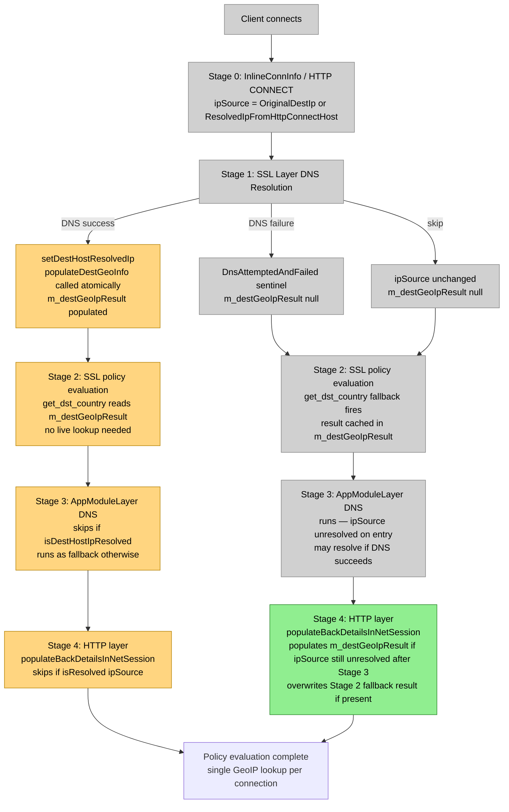

# ENG-970460: Consolidate Destination GeoIP — Design Context

**Jira:** ENG-970460
**Date:** 2026-05-19
**Author:** Amitayu Das
**Status:** Draft
**Related specs:**
- `2026-04-28-eng-710107-dest-addressing-design.md` — predecessor; delivered early SSL-layer GeoIP population
- `2026-04-14-nplan6618-architectural-decisions.md` — NPLAN-6618 architectural decision record

---

## Problem Statement

GeoIP data for the destination IP currently lives in three disconnected places:

1. **`m_backGeoIpResult` on `NetSession`** — the primary copy, populated via
   `populateBackGeoInfo()` at SSL-layer DNS success time (ENG-710107) and at
   HTTP-layer DNS time. The field name is a historical misnomer — it is populated
   before any backend connection exists and reflects the *destination*, not the
   backend.

2. **Back `ConnInfo::m_geoIpResult`** — a redundant copy seeded from the session
   field via `setupBackendInfo()::setGeoIpResult(&m_backGeoIpResult)`, never
   independently updated. This is a 2016 rescue pattern (ENG-33776) that became
   a no-op when `populateBackGeoInfo()` was added to populate the session field
   pre-connection. The rescue copy is still made at setup and copied back at
   teardown via `copyGeoIpResultToLocal()` — both are no-ops that obscure intent
   and waste a `ns_geoip_copy_results()` call on every teardown.

3. **Throwaway live `ns_geoip_get_loc()` in `get_dst_country()`** — fires when
   `m_backGeoIpResult` is null (SSL-layer DNS not attempted or failed), once per
   connection. The result is discarded after returning the country string — never
   cached in the session field. After ENG-710107 (PR #14609), this fallback is
   only needed when DNS failed or was skipped, but its result must be cached
   rather than discarded.

ENG-970460 addresses all three sources. See **What This Ticket Delivers** for
the structured breakdown of deliverables and their diagram node mappings.

---

## What ENG-710107 (PR #14609) Already Delivered

`setDestHostResolvedIp()` now calls `populateBackGeoInfo()` (to be renamed
`populateDestGeoInfo()`) atomically on every successful DNS resolution at the
SSL layer. This means `m_backGeoIpResult` (to be renamed `m_destGeoIpResult`)
is populated before `getPolicyAction()` runs — eliminating the live lookup in
`get_dst_country()` for connections where SSL-layer DNS succeeded.

The four items below remain outstanding.

---

## What This Ticket Delivers

Each item below is a self-contained deliverable. When split across multiple PRs,
each PR references the item numbers it implements. `raise-pr` uses the diagram
node tags to construct Diagram 2 (scope box) and Diagram 3 (zoomed detail).

1. **Rename** `m_backGeoIpResult` → `m_destGeoIpResult`, `populateBackGeoInfo()`
   → `populateDestGeoInfo()`, `getBackGeoIpResult()` → `getDestGeoIpResult()`
   (13 call sites across 8 files).
   Diagram nodes: D, G, G2, J, J2, H, H2 (rename touches all GeoIP paths)

2. **Eliminate back Conn redundancy** — remove `setupBackendInfo()` GeoIP seeding
   (`NetSession.cpp:668`) and `copyGeoIpResultToLocal()` call from `teardown()`
   (`NetSession.cpp:830`). Remove `copyGeoIpResultToLocal()` function entirely.
   Diagram nodes: Stage 3 setup, Stage 5 teardown (no dedicated diagram nodes —
   these are plumbing changes that enable the single-source invariant)

3. **Conditional HTTP-layer re-population** — in `populateBackDetailsInNetSession()`,
   call `populateDestGeoInfo()` only when `!ns::host::isResolved(ipSource)`.
   Diagram nodes: H (DNS-success path skips), H2 (DNS-failure path conditionally populates)

4. **Cache live lookup in `get_dst_country()`** — replace throwaway local
   `geoipResult` with `populateDestGeoInfo(dstIp)`, making `m_destGeoIpResult`
   the single source of truth on the DNS-failure/skip path too.
   Diagram nodes: G2 (fallback path now caches result)

---

## Execution Stages Affected

```
Stage 1 — SSL layer DNS resolution (ENG-710107, already done)  [Deliverable #1]
  File: libs/netsvc/NetSession.hpp:setDestHostResolvedIp()
  What it does today: calls populateBackGeoInfo() atomically on DNS success,
                      storing result in m_backGeoIpResult.
  What this feature changes: rename populateBackGeoInfo → populateDestGeoInfo,
                             m_backGeoIpResult → m_destGeoIpResult.

Stage 2 — SSL policy evaluation  [Deliverable #4]
  File: libs/netlayer/src/SslServerLayer.cpp:getPolicyAction()
        libs/netsvc/src/NetSession.cpp:get_dst_country()
  What it does today: get_dst_country() calls getBackGeoIpResult(); if null,
                      does throwaway ns_geoip_get_loc() (result discarded after
                      returning country string). Gated by ssl_dnd_evaluate_dest_country
                      feature flag in PolicyAssignValueGetter.cpp:940.
  What this feature changes: rename getBackGeoIpResult → getDestGeoIpResult.
                             After rename, get_dst_country() reads session field first.
                             If populated (SSL-layer DNS succeeded), no live lookup needed.
                             Fallback live lookup fires when m_destGeoIpResult is null,
                             but result is now cached in m_destGeoIpResult via
                             populateDestGeoInfo() — making it the single source of truth
                             on all paths. Throwaway local geoipResult variable and
                             ns_geoip_free_results() call are removed.
                             buf/bufsz parameters: kept for interface compatibility with
                             BypassPolicyCfg.hpp virtual signature and the
                             handle_bypass_policy_args() calling convention in
                             PolicyAssignValueGetter.cpp which passes a stack buffer.
                             Since get_dst_country() now returns cached->country.ptr
                             (a pointer valid for the connection lifetime), buf is unused.
                             Parameters are left unnamed in the implementation — no callers
                             need to change.

Stage 3 — AppModuleLayer DNS / back Conn setup  [Deliverable #2, part 1]
  File: libs/netsvc/src/NetSession.cpp:setupBackendInfo() (ln 668)
  What it does today: seeds back ConnInfo with session GeoIP via
                      backendInfo->setGeoIpResult(&m_backGeoIpResult).
  What this feature changes: remove this seeding — back ConnInfo GeoIP is never
                             independently updated; getDestGeoIpResult() will return
                             the session field directly.

Stage 4 — HTTP layer GeoIP  [Deliverable #3]
  File: libs/http/src/HttpRequestEngine.cpp:populateBackDetailsInNetSession() (ln 2252)
  What it does today: always calls populateBackGeoInfo(destIp) when back not connected.
  What this feature changes: add conditional — skip if ipSource > UnresolvedByProxy
                             (already DNS-resolved at SSL layer). Re-populate only when
                             ipSource is in the unresolved group (client-provided IP,
                             potentially spoofed).
                             Note: if get_dst_country() already populated m_destGeoIpResult
                             at Stage 2 (fallback path), populateDestGeoInfo() here
                             overwrites it with the HTTP-layer DNS-resolved IP, which is
                             more trustworthy. This is correct — the HTTP-layer IP is
                             always from a service-performed DNS resolution.

Stage 5 — Teardown  [Deliverable #2, part 2]
  File: libs/netsvc/src/NetSession.cpp:teardown() (ln 830)
        libs/netsvc/src/NetSession.cpp:copyGeoIpResultToLocal() (ln 799)
  What it does today: copies back Conn GeoIP to session field before back Conn release.
                      This is now a no-op since back Conn GeoIP is seeded FROM session field.
  What this feature changes: remove copyGeoIpResultToLocal() call from teardown.
                             Remove copyGeoIpResultToLocal() function entirely.
```

---

## Proxy Mode Applicability

Each cell describes what happens to `m_destGeoIpResult` at that stage.
"populated" = `populateDestGeoInfo()` called, result stored in session field.
"read" = session field read (no new GeoIP lookup).
"no action" = `populateDestGeoInfo()` not called — ipSource already resolved,
              conditional introduced by Deliverable #3 prevents redundant call.
"call removed" = `copyGeoIpResultToLocal()` call eliminated by Deliverable #2;
                 this was a no-op rescue copy that is being deleted entirely.

```
                     Stage 1            Stage 2              Stage 3            Stage 4            Stage 5
                     SSL DNS            SSL policy eval      AppModuleLayer     HTTP layer         Teardown
Transparent proxy
  DNS success:       populated          read (no lookup)     no action          no action          call removed
  DNS failure:       not populated      populated            may populate*      may populate**     call removed

Explicit proxy
  DNS success:       populated          read (no lookup)     no action          no action          call removed
  DNS failure:       not populated      populated            may populate*      no action***       call removed
```

*  Stage 3 (AppModuleLayer DNS): runs because ipSource is unresolved on entry.
   If AppModuleLayer DNS succeeds, setDestHostResolvedIp() calls populateDestGeoInfo()
   as a side effect — m_destGeoIpResult becomes populated.
   If AppModuleLayer DNS also fails, m_destGeoIpResult retains the Stage 2 fallback value.

** Stage 4 (HTTP layer): populateBackDetailsInNetSession() checks isResolved(ipSource).
   If Stage 3 resolved the IP, ipSource > UnresolvedByProxy → no action.
   If still unresolved, populateDestGeoInfo() is called and overwrites the Stage 2
   fallback result with the HTTP-layer DNS-resolved IP (more trustworthy).

*** Explicit proxy Stage 4: CONNECT resolved the domain at Stage 0, so ipSource is
    already ResolvedIpFromHttpConnectHost (or higher) by the time Stage 4 runs.
    isResolved(ipSource) is true → no action.

**Transparent proxy end-to-end (DNS success):**
SSL DNS succeeds → `populateDestGeoInfo()` called inside `setDestHostResolvedIp()` →
`m_destGeoIpResult` populated → SSL policy (`get_dst_country()`) reads session
field, no live lookup → Stage 3 AppModuleLayer DNS skips (isDestHostIpResolved) →
Stage 4 `populateBackDetailsInNetSession()` skips (ipSource resolved).
Single GeoIP lookup per connection.

**Transparent proxy end-to-end (DNS failure):**
SSL DNS fails → `m_destGeoIpResult` null → SSL policy calls `get_dst_country()` →
`getDestGeoIpResult()` returns null → live lookup fires → result cached in
`m_destGeoIpResult` via `populateDestGeoInfo()` → Stage 3 AppModuleLayer DNS
runs (ipSource unresolved on entry, may resolve) → Stage 4
`populateBackDetailsInNetSession()` runs if ipSource still unresolved, overwrites
`m_destGeoIpResult` with HTTP-layer DNS-resolved IP (more trustworthy).

**Explicit proxy end-to-end:**
CONNECT stage resolves domain → `ipSource = ResolvedIpFromHttpConnectHost` →
SSL DNS may run for SNI → `populateDestGeoInfo()` on success → SSL policy reads
session field, no live lookup → Stage 3 and Stage 4 both skip.

---

## Design Contracts

1. `getDestGeoIpResult()` returns `&m_destGeoIpResult` directly (no two-source
   lookup). Returns null if `!ns_geoip_is_valid(&m_destGeoIpResult)`.

2. `setupBackendInfo()` does not seed back ConnInfo GeoIP from the session field.
   The back ConnInfo `m_geoIpResult` is never populated in production code paths.

3. `teardown()` does not call `copyGeoIpResultToLocal()`. The function is removed.

4. In `populateBackDetailsInNetSession()`, `populateDestGeoInfo()` is called only
   when `!ns::host::isResolved(m_nsession.getDestHost().ipSource)`.

5. `get_dst_country()` reads `getDestGeoIpResult()` first; if null (DNS failed
   or was not attempted), calls `populateDestGeoInfo(dstIp)` to run the GeoIP
   lookup and store the result in `m_destGeoIpResult`. Subsequent calls by any
   consumer (`HttpRequestEngine`, `FtpPolicy`, `SslDndAlertSender`, etc.) read
   the cached session field — no repeated lookup. The throwaway local
   `geoipResult` variable and `ns_geoip_free_results()` call are removed.
   `m_destGeoIpResult` is the single source of truth on all paths.
   `buf`/`bufsz` parameters are retained (interface compatibility with
   `BypassPolicyCfg.hpp` virtual signature and `handle_bypass_policy_args()`
   calling convention) but left unnamed in the implementation — unused since
   `cached->country.ptr` is valid for the connection lifetime.

6. All 13 call sites of `getBackGeoIpResult()` across 8 files are updated to
   `getDestGeoIpResult()`. No caller references the old name.

7. Functional change on the DNS-failure/skip path: `m_destGeoIpResult` is now
   populated by `get_dst_country()` when it was previously null. All consumers
   of `getDestGeoIpResult()` that previously received null on this path now
   receive a valid result after `get_dst_country()` has been called once.
   If Stage 4 subsequently runs, it overwrites with the HTTP-layer DNS-resolved
   IP which is more trustworthy than the Stage 2 fallback lookup result.

---

## State / Data Model Changes

```
Field: m_backGeoIpResult → renamed to m_destGeoIpResult
Type: ns_geoip_result_t (unchanged)
Location: NetSession — libs/netsvc/NetSession.hpp
Lifecycle: populated at Stage 1 (setDestHostResolvedIp on DNS success),
           OR at Stage 2 (get_dst_country() fallback when Stage 1 DNS failed/skipped),
           OR at Stage 4 (populateBackDetailsInNetSession when ipSource still unresolved).
           Never seeded from back ConnInfo.
Invariant: Single source of truth for destination GeoIP. Back ConnInfo GeoIP
           field (ConnInfo::m_geoIpResult) is never populated in production.

Method: populateBackGeoInfo() → renamed to populateDestGeoInfo()
Method: getBackGeoIpResult() → renamed to getDestGeoIpResult(); simplified to
        return &m_destGeoIpResult directly (no two-source lookup).
Method: copyGeoIpResultToLocal() → removed entirely.
```

---

## Failure Modes and Fallback Policy

```
Failure: populateDestGeoInfo() fails (ns_geoip_get_loc returns NS_RESULT_ERR)
  At Stage 1: m_destGeoIpResult remains invalid. get_dst_country() at Stage 2
              will attempt fallback live lookup via populateDestGeoInfo() again.
  At Stage 2 (fallback): m_destGeoIpResult remains invalid. get_dst_country()
              returns null. Policy engine receives no country value.
  At Stage 4: m_destGeoIpResult remains invalid (or retains Stage 2 value if
              Stage 2 fallback succeeded). No further fallback.

Failure: SSL DNS fails → m_destGeoIpResult null at SSL policy time
Result: get_dst_country() calls populateDestGeoInfo(dstIp) — result cached in
        m_destGeoIpResult. If populateDestGeoInfo() succeeds, subsequent consumers
        (HttpRequestEngine, FtpPolicy, SslDndAlertSender, etc.) read the cached
        value — no repeated lookup. If Stage 4 also runs (ipSource still
        unresolved after Stage 3), populateDestGeoInfo() overwrites with the
        HTTP-layer DNS-resolved IP, which is more trustworthy.

Failure: back ConnInfo GeoIP now never populated (seeding removed)
Result: getDestGeoIpResult() returns session field directly. All callers
        that previously accessed back ConnInfo GeoIP through the two-source lookup
        now read the session field — same value, since seeding was a copy.
        Risk: any code path that calls setGeoIpResult() or setLocationIp() on
        back Conn independently would be lost. Verified by grep: no such call
        exists in production code (setLocationIp is only called on front Conn;
        setGeoIpResult on back Conn is only in setupBackendInfo() which we
        are removing).
```

---

## Known Gaps and Deferred Work

1. **`ResolvedIpFromHttpHost` (ipSource = 8) not yet produced:** The enum value
   exists but no code path sets it. HTTP-layer DNS resolution still uses the
   legacy `populateBackDetailsInNetSession()` path. Full HTTP-layer `IpSource`
   tracking is out of scope for this ticket.

2. **`isDnsResolutionAttemptedInPrior()` flag redundancy:** After ENG-970460, the
   AppModuleLayer DNS skip gate can be simplified to `isDestHostIpResolved()` alone.
   The `isDnsResolutionAttemptedInPrior()` flag becomes redundant. Tracked as
   part of ADR gap #4.

3. **Row 4b architectural gap:** Unchanged from ENG-710107. See
   `2026-04-28-eng-710107-dest-addressing-design.md` §Known Gaps, item 5.

4. **`ConnInfo::m_geoIpResult` cannot be fully eliminated:** ENG-970460 removes
   all population of `m_geoIpResult` on the **back** Conn (by removing the
   seeding in `setupBackendInfo()`), making it permanently unpopulated — which is
   functionally equivalent to not having it. However, the field cannot be removed
   from `ConnInfo` itself because `ConnInfo` is shared by both front and back Conn,
   and `m_geoIpResult` on the **front** Conn is actively used for source/egress
   GeoIP by several independent call paths:
   - `setLocationIp()` — called from `InlineConnectionInfo.cpp`, `NetListener.cpp`,
     `FlowDataUtil.cpp`, `HttpRequestEngine.cpp`, `HttpSessionC.cpp`
   - `getGeoIpResult()` on front Conn — read by `EgressIpUtil.cpp`,
     `EgressIpPolicy.cpp`, `NetSessionC.cpp`
   Removing the field would require splitting `ConnInfo` into front and back
   variants, or introducing a separate struct for back Conn state — a significant
   refactor with risk to the egress IP and source GeoIP paths. Out of scope for
   this ticket. The back Conn field becoming unpopulated is the practical outcome.

   **Deferred follow-on:** After ENG-970460, `m_geoIpResult` on the back Conn
   is permanently unpopulated — it is exclusively a front Conn field holding the
   client's source location GeoIP. Renaming it to `m_sourceGeoIpResult` in
   `ConnInfo` (and all callers) would reflect this purpose unambiguously without
   any structural change to `ConnInfo`. This is a mechanical rename, similar in
   scope to Change 1 in this ticket. Recommended as a separate follow-on ticket.

---

## Implementation Breakdown

```
Single PR for all 4 changes:
  Change 1 — Rename (m_backGeoIpResult → m_destGeoIpResult,
                      populateBackGeoInfo → populateDestGeoInfo,
                      getBackGeoIpResult → getDestGeoIpResult; 13 call sites)
  Change 2 — Eliminate back Conn redundancy (setupBackendInfo seeding + teardown copy)
  Change 3 — Conditional HTTP-layer re-population
  Change 4 — get_dst_country() caching: replace throwaway live lookup with
             populateDestGeoInfo(); remove local geoipResult variable and
             ns_geoip_free_results(); leave buf/bufsz unnamed.

Implementation order within PR:
  1. Change 2 first (confirm safety of removing back Conn seeding)
  2. Change 1 (rename — mechanical, all callers updated atomically)
  3. Change 3 (conditional, depends on rename)
  4. Change 4 (caching logic, depends on rename)

Dependency: branch off feature/eng-710107-dest-addressing or develop after
that PR merges. Do not start development until PR #14609 is merge-imminent.
```

---

## Diagrams

> **Color legend:** Grey = existed before this EPIC.
> Green = new with this EPIC. Amber = existing but enhanced.

### Diagram 1 — Full NPLAN-6618 GeoIP vision (what ENG-970460 builds toward)


